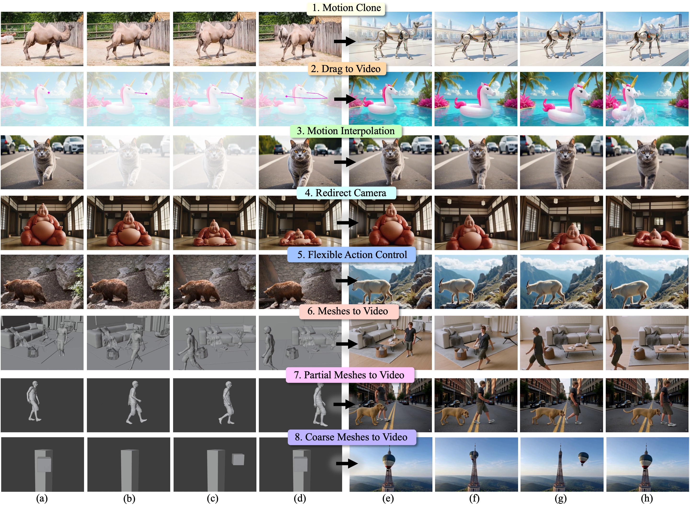

# FlexTraj: Image-to-Video Generation with Flexible Point Trajectory Control (CVPR 26)



Zhiyuan Zhang $^{1}$, Wang Can $^{2}$,, [Dongdong Chen](https://www.dongdongchen.bid/) $^{3}$, [Jing Liao](https://www.cityu.edu.hk/stfprofile/jingliao.htm) $^{1}$

<font size="1"> $^1$: City University of Hong Kong, Hong Kong SAR
<font size="1"> $^2$: The University of Hong Kong, Hong Kong SAR
<font size="1"> $^3$: Microsoft GenAI </font>

## Abstract:
We present FlexTraj, a framework for image-to-video generation with flexible point trajectory control. FlexTraj introduces a unified point-based motion representation that encodes each point with a segmentation ID, a temporally consistent trajectory ID, and an optional color channel for appearance cues, enabling both dense and sparse trajectory control. Instead of injecting trajectory conditions into the video generator through token concatenation or ControlNet, FlexTraj employs an efficient sequence-concatenation scheme that achieves faster convergence, stronger controllability, and more efficient inference, while maintaining robustness under unaligned conditions. To train such a unified point trajectory-controlled video generator, FlexTraj adopts an annealing training strategy that gradually reduces reliance on complete supervision and aligned condition. Experimental results demonstrate that FlexTraj enables multi-granularity, alignment-agnostic trajectory control for video generation, supporting various applications such as motion cloning, drag-based image-to-video, motion interpolation, camera redirection, flexible action control and mesh animations.

## Checkpoints and FlexBench Dataset

Download the released FlexTraj checkpoints and FlexBench dataset from Hugging Face:

```bash
huggingface-cli download bestzzhang/FlexTraj --local-dir checkpoints
huggingface-cli download bestzzhang/FlexBench --local-dir FlexBench --repo-type dataset
```

## Usage

### FlexBench Evaluation

For model-specific setup and inference instructions, please refer to:

- [WAN implementation](WAN/instruction_wan.md)
- [CogVideoX implementation](CogVideoX/instruction_cogvideox.md)

### Custom Data

For preparing and running custom data, please refer to [Data Preparation](data_prepare/Instruction_data.md).

